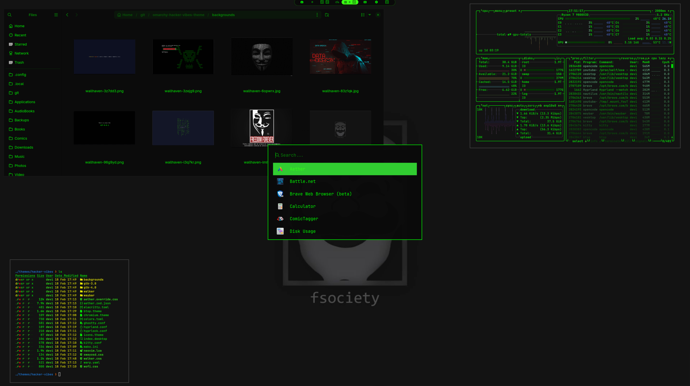

# omarchy-hacker-vibes-theme  
&nbsp;  
&nbsp;    
Hacker Vibes - You've been hacking into the mainframe. This theme brings that retro terminal aesthetic straight to your desktop with glowing green text on a pitch-black screen. Perfect for debugging code at 3am, pretending to crack Pentagon firewalls, or just really loving The Matrix. Neo would approve.  
&nbsp;  
&nbsp;  
&nbsp;  
# Screenshot:  
 
&nbsp;  
&nbsp;  
&nbsp;   
&nbsp;  
&nbsp;        
# Installation Theme  
&nbsp;  
To install this theme, simply use the omarchy-theme-install command:  
&nbsp;  
```omarchy-theme-install https://github.com/Deoxizn/omarchy-hacker-vibes-theme.git```  
&nbsp;    
&nbsp;  
&nbsp;    
&nbsp;      
# Vesktop-Theme
&nbsp;  
For Vesktop users, you can install this theme by copying the theme file to your Vesktop themes directory:  
&nbsp;  
```cp ~/.config/omarchy/themes/hacker-vibes/vencord.theme.css ~/.config/vesktop/themes/vencord.theme.css```  
&nbsp;    
&nbsp;  
&nbsp;    
&nbsp;      
# Waybar-Theme  
&nbsp;  
For the waybar, you can install this theme by copying the config.jsonc file and style.css to your waybar directory:  
&nbsp;   
```yay -S waybar-module-pacman-updates-git```  
```cp -r ~/.config/omarchy/themes/hacker-vibes/waybar ~/.config/waybar```  
&nbsp;    
&nbsp;  
&nbsp;    
&nbsp;      
# GTK3.0/GTK4.0-Theme  
&nbsp;  
&nbsp;  
&nbsp; For GTK File Managers, you can install this theme by copying the toml file to your ~/.config directory:    
&nbsp;   
```cp -r ~/.config/omarchy/themes/hacker-vibes/gtk-3.0 ~/.config/```  
```cp -r ~/.config/omarchy/themes/hacker-vibes/gtk-4.0 ~/.config/```
