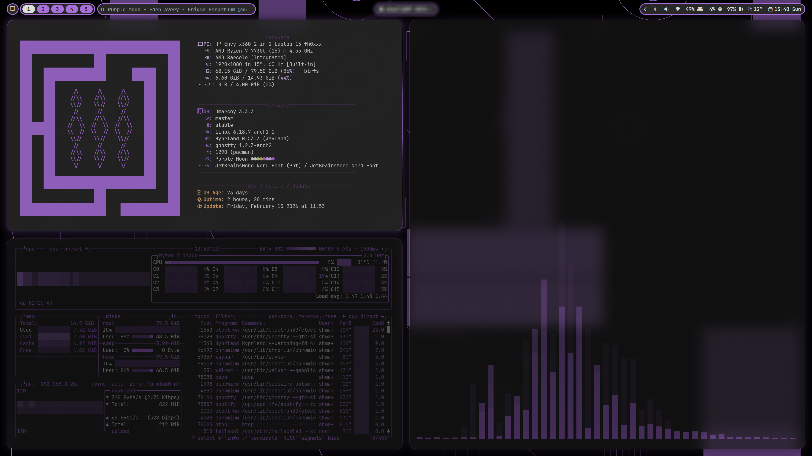
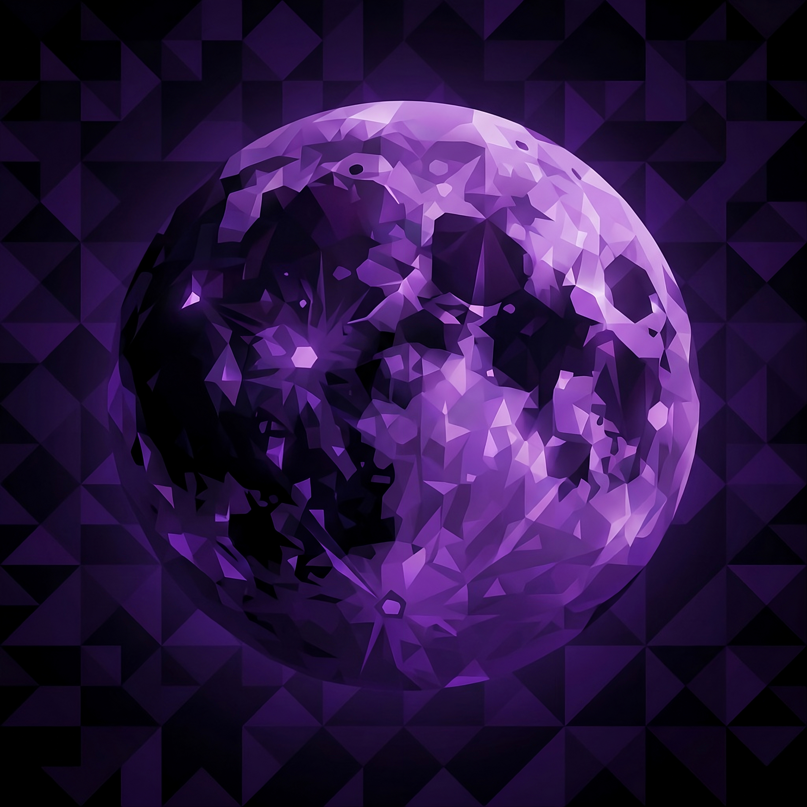
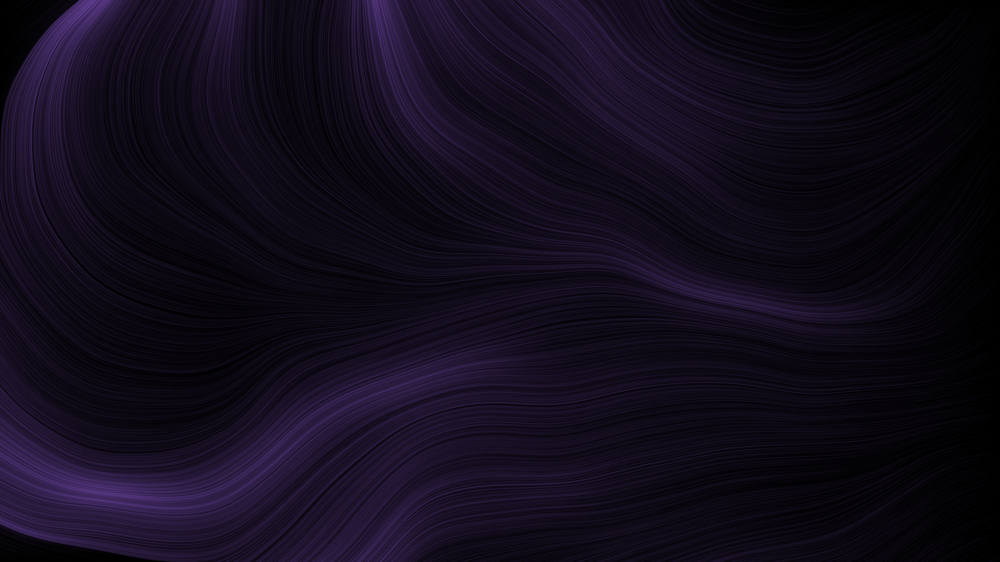
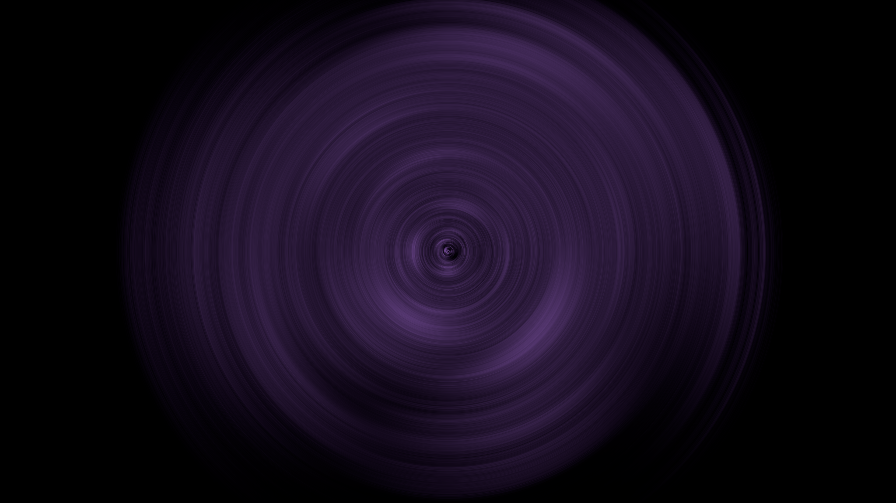

# ✨ Spectral Violet: An Omarchy Theme

[](LICENSE)
[](https://github.com/shmall03/Spectral-Violet)
[](https://github.com/Omarchy/Omarchy)


> **A premium, "Spectral Violet" aesthetic for the Omarchy power-user.**
>
> Dive into a desktop experience crafted with a spectral touch, blending deep purples and high-contrast readability with vibrant neon accents. Inspired by the intricate textures of generative art, Spectral Violet offers a moody yet immersive environment.
>
> 💡 These configs are modular — use them all for a unified look or mix and match to your liking.

---

## ✨ Features

- **Comprehensive Theme Support:** Over 20+ applications themed for a truly unified desktop experience.
- **Spectral Aesthetic:** A deep obsidian base (`#17111C`) with vibrant, neon accents.
- **Custom Wallpaper Pack:** Includes 6 exclusive backgrounds designed specifically to complement the palette.
- **Modular & Flexible:** Use the full Omarchy theme or pick and choose individual config files to suit your setup.
- **High-Contrast Design:** Prioritises readability and visual clarity while maintaining a moody, immersive vibe.

---

## 🖥️ Themed Applications

| Category | Applications |
| :--- | :--- |
| **System / WM** | Hyprland, Hyprlock, Waybar, Mako, SwayOSD, Walker, Wofi |
| **Terminal** | Alacritty, Kitty, Ghostty |
| **Browsers** | Zen Browser, Chromium |
| **Code / Dev** | Neovim, VS Code, Cava, btop |
| **Social / Apps** | Steam, Vencord (Discord) |
| **UI / Frameworks** | GTK (3/4), Qt6ct, Icons |
| **Other** | Limine (Bootloader), Vicinae |

---

## 🛠️ Requirements

To fully enjoy the Spectral Violet theme, the following software and components are recommended or required:

-   **[Omarchy](https://omarchy.org):** The Linux distribution that provides integrated theme management.
-   **[Hyprland](https://hyprland.org/):** A dynamic tiling Wayland compositor.
-   **[Waybar](https://github.com/Alexays/Waybar):** Highly customisable Wayland bar for displaying system information.
-   **GTK (3 & 4):** For styling GTK-based applications.
-   **Qt6:** For styling Qt6-based applications (via `qt6ct`).
-   **Fonts:** Ensure you have appropriate Nerd Fonts or similar icon fonts installed for full glyph support.

---

## ⚡ Installation (Quick Setup)

### 🪄 Install via Omarchy (Recommended)

If you use **Omarchy**, you can install the theme directly from the style/theme installer.

**Steps:**

1. 📋 Copy this repository URL:
   ```bash
   https://github.com/shmall03/spectral-violet
   ```
2. 🪄 Open the Omarchy menu (`Super + Alt + Space`).
3. 🎨 Go to `Install > Style > Theme`.
4. 🔗 Paste the URL and press **Enter**.
5. ⏳ Wait for installation to complete.
6. 🌙 Apply the theme from the Omarchy menu.

> 💬 Tip: If you see a message like "opencode: no process found" at the end of the installation, this is usually harmless and indicates that a code editor was not configured to launch automatically.

> 💬 Tip: You can preview wallpapers or tweak colours before applying to personalise your setup.

---

## 🎨 Customisation

Every file in this repository can be adjusted to suit your preferences. Open any `.css`, `.conf`, or `.toml` file to modify:

- 🎨 Colour palette
- 🔤 Font families and sizes
- 🪞 Layout spacing and padding

---

## 🤝 Contributing

💡 Contributions are welcome! Whether you want to tweak the palette, add new app configurations, or improve compatibility — submit a PR and help refine Spectral Violet.

---

## 📄 License

This project is licensed under the **MIT License**. See the [LICENSE](LICENSE) file for more details.

---

## 🖼️ Wallpaper Showcase

Spectral Violet comes with 6 custom-designed backgrounds to complete the spectral aesthetic.

| | | |
| :--- | :--- | :--- |
|  |  |  |
| **Purple Moon** | **Perlin Flowfield** | **Radial Blur** |
|  |  |  |
| **Recursive Geometry** | **Topography Dots** | **Hypercube Circles** |

---

## Acknowledgements

Special thanks to Aether by Bjarne Øverli for providing an outstanding theme creation tool for Omarchy. This project benefits from the flexible palette, blueprint, and template features pioneered by Aether.

Further thanks to [Grey-007](https://github.com/Grey-007) for providing the foundational [purple-moon](https://github.com/Grey-007/purple-moon) that served as a basis for Spectral Violet.

---

## 👋 Let's Connect

Feel free to explore more of my work or connect with me:

-   **GitHub:** [@shmall03](https://github.com/shmall03)